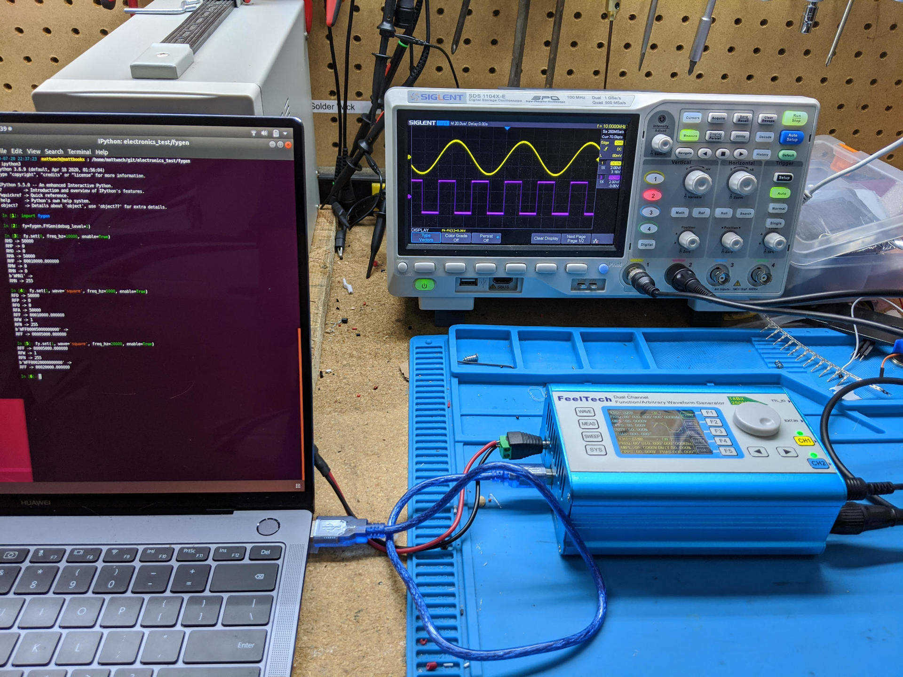
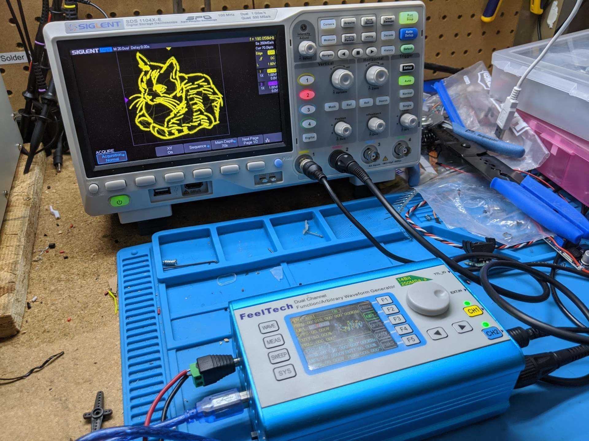
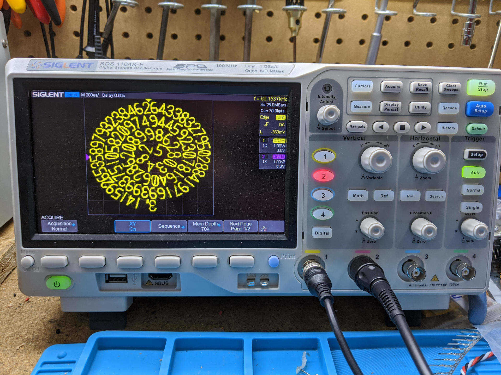
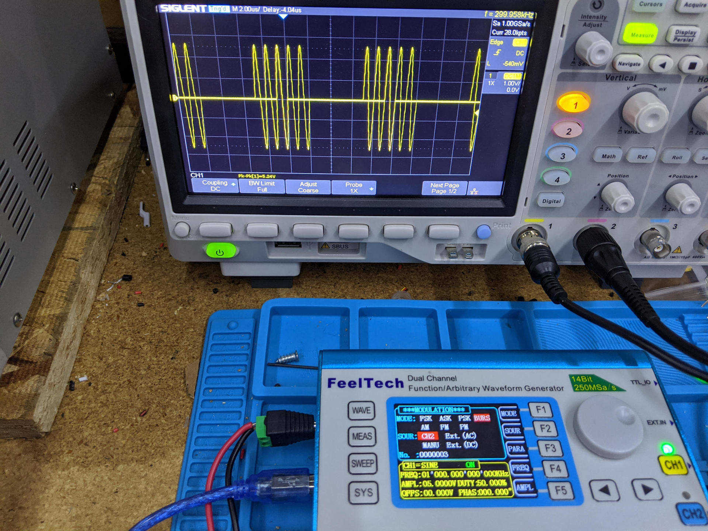
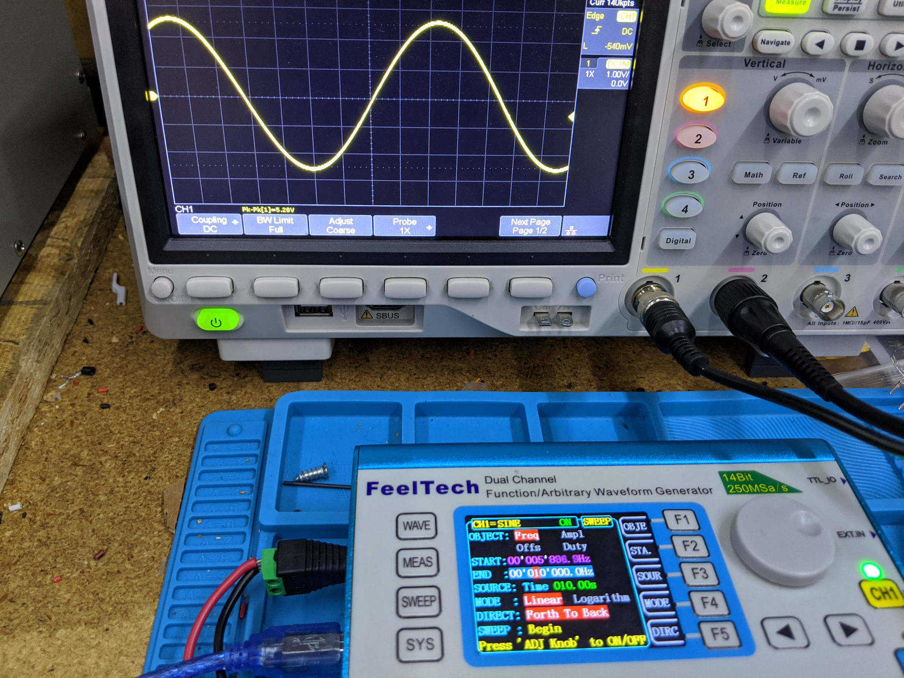
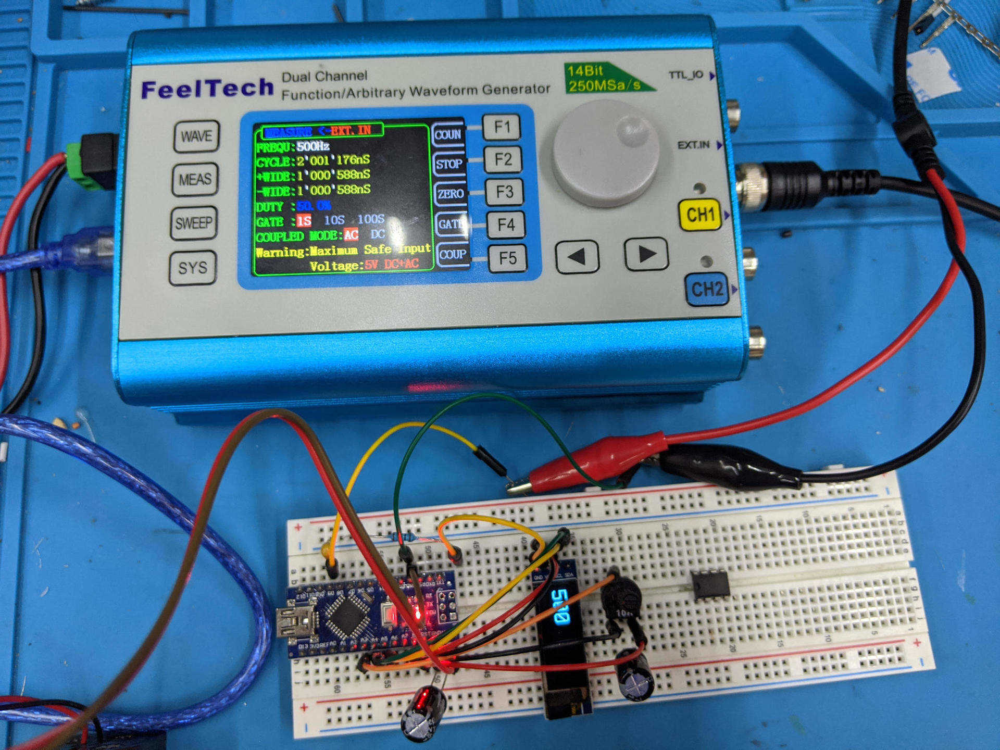
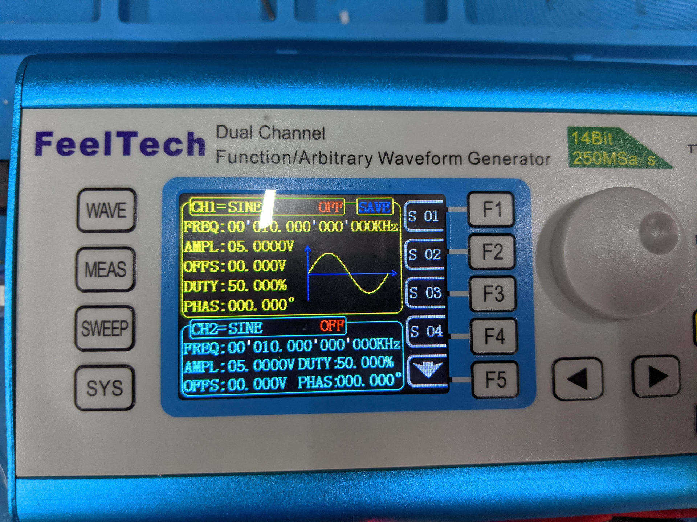
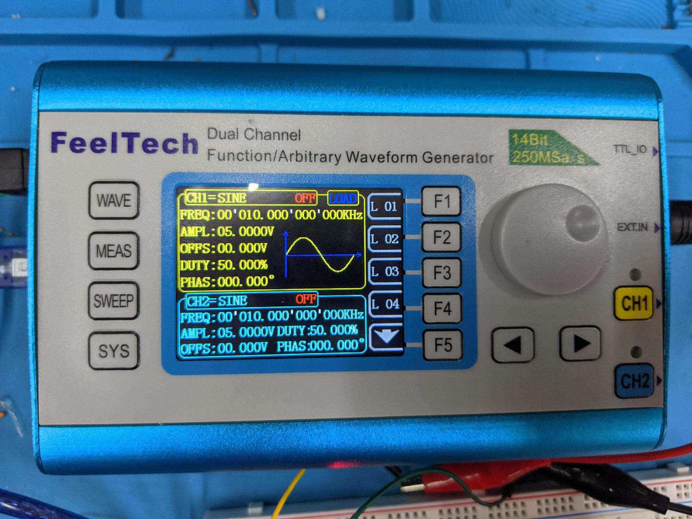
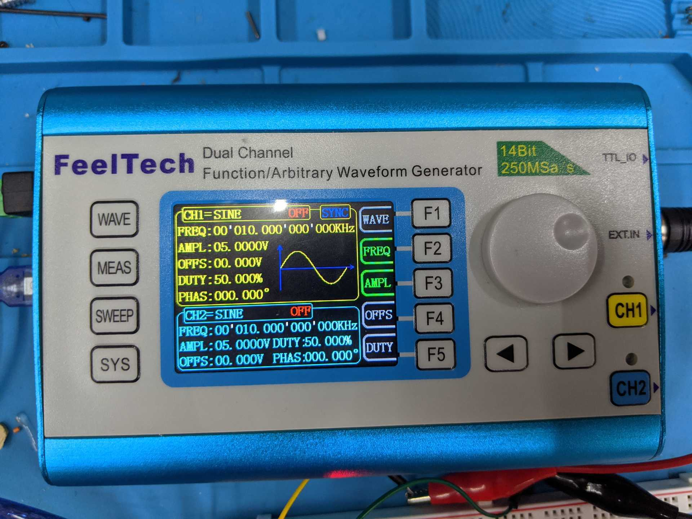
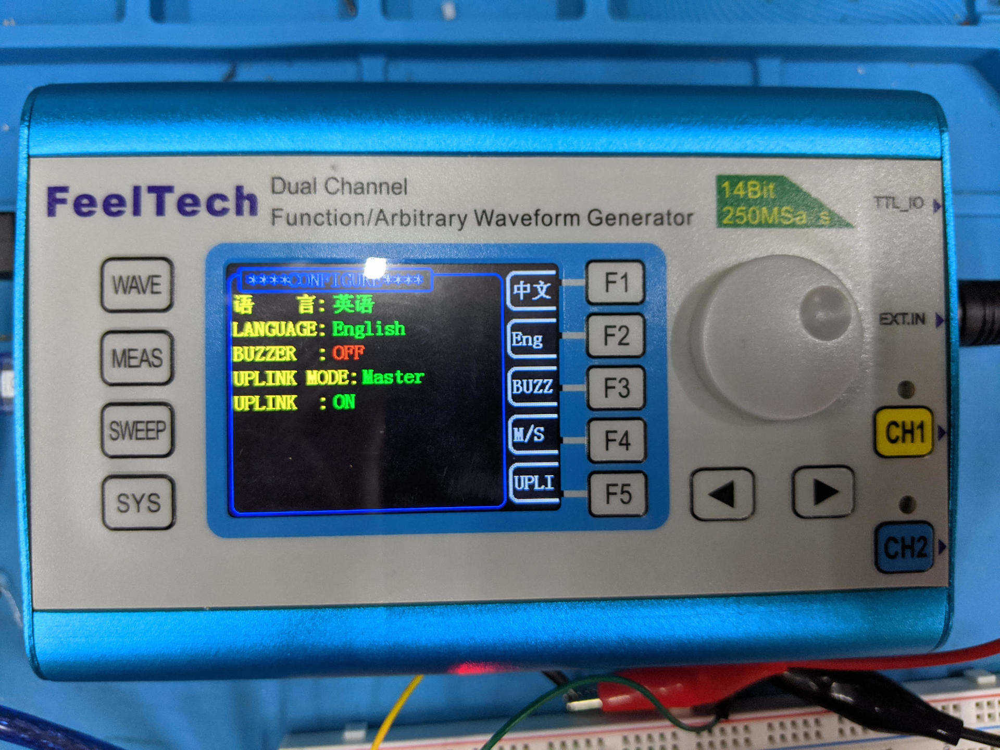

# Table of Contents

  - [Introduction](#introduction)
  - [Prerequisites](#prerequisites)
  - [Basic Usage](#basic-usage)
  - [Low Level Access](#low-level-access)
  - [Available Waveforms](#available-waveforms)
  - [Custom Waveforms](#custom-waveforms)
  - [Modulation](#modulation)
  - [Sweep](#sweep)
  - [Measurement](#measurement)
  - [Parameter Load and Save](#parameter-load-and-save)
  - [Parameter Synchronization](#parameter-synchronization)
  - [Uplink Mode](#uplink-mode)
  - [Miscellaneous Functions](#miscellaneous-functions)
  - [Read-Before-Write](#read-before-write)
  - [Initial State](#initial-state)
  - [Streaming Output to a File](#streaming-output-to-a-file)
  - [Troubleshooting](#troubleshooting)
  - [Development](#development)

# Introduction

`fygen` is a library that allows you to control any of several Feeltech signal
generators.  It was developed with the
[FY2300](http://en.feeltech.net/index.php?case=archive&act=show&aid=17) which is
nearly identical to the
[FY6600](http://en.feeltech.net/index.php?case=archive&act=show&aid=59) and
[FY6800](http://en.feeltech.net/index.php?case=archive&act=show&aid=61) in
features.  Other generators should also work, although some tweaks may be
required.

`fygen` has the following features:
  - Comprehensive support (custom waveforms, measurements, etc)
  - High level and low level access methods.
  - A full set of unit tests.
  - The code is lint clean (using the provided lint rules).
  - Each function was validated with a real FY2300.
  - Open source, pure Python.
  - Supports Python 2 and Python 3.
  - Supports most OSes (Linux, Windows, Mac)
  - Comprehensive usage documentation and examples are included.

You can also use it with the XY function to draw a Kitty:

Or some pi:

## Disclaimer

fygen is free and open source software.  I accept no responsibility
or liability for any damage caused, time lost, or money lost as a result of
using this software.  You should test all features in a safe manner and assume
responsibility for anything that might go wrong. If this is not acceptable,
please do not use this software.

# Prerequisites

You may use either Python 2 or Python 3.

For either, you will need the [pyserial](https://pypi.org/project/pyserial/)
package.  The process of installing this package will vary depending on your
environment.  Some examples:

Ubuntu + Python2:

    sudo apt install python-serial

Ubuntu + Python3:

    sudo apt install python3-serial

If you plan on using this library interactively, I recommend trying
[ipython](ipython.org), which can be easily installed in Ubuntu via:

    sudo apt install ipython ipython3

# Basic Usage

You must determine the serial port address of your connected signal generator.
In Linux, `/dev/ttyUSB0` is commonly correct.  This is also is the default
value.

    import fygen
    fy = fygen.FYGen('/dev/ttyUSB0', debug_level=1)
    fy = fygen.FYGen(debug_level=1)  # Same thing
    
Once connected, this command will setup a 1Mhz sin wave on the main channel:

    fy.set(
      channel=fygen.CH1,
      enable=True,
      wave='sin',
      freq_hz=1e6,
      volts=5)
    
All `set()` parameters are optional.  Commands can be split arbitrarily.  This
sequence should have the same behavior as above:

    fy.set(0, wave='sin')
    fy.set(0, freq_hz=1e6)
    fy.set(0, volts=5)
    fy.set(0, enable=True)
    
For channel, you can use CH1, CH2 or just 0 and 1. You can send to multiple
channels at the same time by providing a list or tuple:

    fy.set(channel=(0,1), volts=3)
    
You can also set the default channel(s) that subsequent command will use
if not given a channel parameter:

    fy.default_channel=(0,1)
    fy.set(volts=4)
    
You can use a python `dict` to hold settings:

    ch1_settings = {
      'channel': fygen.CH1,
      'enable': True,
      'wave': 'square',
      'freq_hz': 5e5,
      'volts': 3.5
    }
    fy.set(**ch1_settings)
    
    ch2_settings = dict(ch1_settings)
    ch2_settings.update({'channel': fygen.CH2, 'volts': 1})
    fy.set(**ch2_settings)
    
See more docs on set

    help(fygen.FYGen.set)

Or online help:

    fygen.help()

# Low Level Access

The `fygen` library offers low level access.

If you issue the `send()` method, the command will be sent to the device
and the response from the signal generator will be returned.  Some examples:

    fy = fygen.FYGen()
    fy.send('WMW0')
    fy.send('RMW')

You can also see the commands send by adding the `debug_level` option:

    fy = fygen.FYGen(debug_level=1)
    fy.set(wave='sin')
      WMW00

As illustrated, low-level commands sent will be output to the console.  There
is also a `debug_level=2` option to hold off sending the commands until you
press enter.

See `examples/lowlevel` for some code examples.

# Available Waveforms
|Name           |Description                             |Channels|
|---------------|----------------------------------------|--------|
|`sin`          |Sin                                     |    0, 1|
|`square`       |Square                                  |    0, 1|
|`cmos`         |CMOS                                    |    0, 1|
|`adj-pulse`    |Adjustable Pulse                        |       0|
|`dc`           |DC                                      |    0, 1|
|`tri`          |Triangle                                |    0, 1|
|`ramp`         |Ramp                                    |    0, 1|
|`neg-ramp`     |Negative Ramp                           |    0, 1|
|`stair-tri`    |Stairstep Triangle                      |    0, 1|
|`stair`        |Stairstep                               |    0, 1|
|`neg-stair`    |Negative Stairstep                      |    0, 1|
|`exp`          |Exponential                             |    0, 1|
|`neg-exp`      |Negative Exponential                    |    0, 1|
|`fall-exp`     |Falling Exponential                     |    0, 1|
|`neg-fall-exp` |Negative Falling Exponential            |    0, 1|
|`log`          |Logarithm                               |    0, 1|
|`neg-log`      |Negative Logarithm                      |    0, 1|
|`fall-log`     |Falling Logarithm                       |    0, 1|
|`neg-fall-log` |Negative Falling Logarithm              |    0, 1|
|`full-wav`     |Full Wave                               |    0, 1|
|`neg-full-wav` |Negative Full Wave                      |    0, 1|
|`half-wav`     |Half Wave                               |    0, 1|
|`neg-half-wav` |Negative Half Wave                      |    0, 1|
|`lorentz`      |Lorentz Pulse                           |    0, 1|
|`multitone`    |Multitone                               |    0, 1|
|`rand`         |Random                                  |    0, 1|
|`ecg`          |ECG                                     |    0, 1|
|`trap`         |Trapezoidal Pulse                       |    0, 1|
|`sinc`         |Sinc Pulse                              |    0, 1|
|`impulse`      |Impulse                                 |    0, 1|
|`gauss`        |Gauss White Noise                       |    0, 1|
|`am`           |AM                                      |    0, 1|
|`fm`           |FM                                      |    0, 1|
|`chirp`        |Chirp                                   |    0, 1|
|`arb1`         |Arbitrary Waveform 1                    |    0, 1|
|`arb2`         |Arbitrary Waveform 2                    |    0, 1|
|`arb3`         |Arbitrary Waveform 3                    |    0, 1|
|`arb4`         |Arbitrary Waveform 4                    |    0, 1|
|`arb5`         |Arbitrary Waveform 5                    |    0, 1|
|`arb6`         |Arbitrary Waveform 6                    |    0, 1|
|`arb7`         |Arbitrary Waveform 7                    |    0, 1|
|`arb8`         |Arbitrary Waveform 8                    |    0, 1|
|`arb9`         |Arbitrary Waveform 9                    |    0, 1|
|`arb10`        |Arbitrary Waveform 10                   |    0, 1|
|`arb11`        |Arbitrary Waveform 11                   |    0, 1|
|`arb12`        |Arbitrary Waveform 12                   |    0, 1|
|`arb13`        |Arbitrary Waveform 13                   |    0, 1|
|`arb14`        |Arbitrary Waveform 14                   |    0, 1|
|`arb15`        |Arbitrary Waveform 15                   |    0, 1|
|`arb16`        |Arbitrary Waveform 16                   |    0, 1|
|`arb17`        |Arbitrary Waveform 17                   |    0, 1|
|`arb18`        |Arbitrary Waveform 18                   |    0, 1|
|`arb19`        |Arbitrary Waveform 19                   |    0, 1|
|`arb20`        |Arbitrary Waveform 20                   |    0, 1|
|`arb21`        |Arbitrary Waveform 21                   |    0, 1|
|`arb22`        |Arbitrary Waveform 22                   |    0, 1|
|`arb23`        |Arbitrary Waveform 23                   |    0, 1|
|`arb24`        |Arbitrary Waveform 24                   |    0, 1|
|`arb25`        |Arbitrary Waveform 25                   |    0, 1|
|`arb26`        |Arbitrary Waveform 26                   |    0, 1|
|`arb27`        |Arbitrary Waveform 27                   |    0, 1|
|`arb28`        |Arbitrary Waveform 28                   |    0, 1|
|`arb29`        |Arbitrary Waveform 29                   |    0, 1|
|`arb30`        |Arbitrary Waveform 30                   |    0, 1|
|`arb31`        |Arbitrary Waveform 31                   |    0, 1|
|`arb32`        |Arbitrary Waveform 32                   |    0, 1|
|`arb33`        |Arbitrary Waveform 33                   |    0, 1|
|`arb34`        |Arbitrary Waveform 34                   |    0, 1|
|`arb35`        |Arbitrary Waveform 35                   |    0, 1|
|`arb36`        |Arbitrary Waveform 36                   |    0, 1|
|`arb37`        |Arbitrary Waveform 37                   |    0, 1|
|`arb38`        |Arbitrary Waveform 38                   |    0, 1|
|`arb39`        |Arbitrary Waveform 39                   |    0, 1|
|`arb40`        |Arbitrary Waveform 40                   |    0, 1|
|`arb41`        |Arbitrary Waveform 41                   |    0, 1|
|`arb42`        |Arbitrary Waveform 42                   |    0, 1|
|`arb43`        |Arbitrary Waveform 43                   |    0, 1|
|`arb44`        |Arbitrary Waveform 44                   |    0, 1|
|`arb45`        |Arbitrary Waveform 45                   |    0, 1|
|`arb46`        |Arbitrary Waveform 46                   |    0, 1|
|`arb47`        |Arbitrary Waveform 47                   |    0, 1|
|`arb48`        |Arbitrary Waveform 48                   |    0, 1|
|`arb49`        |Arbitrary Waveform 49                   |    0, 1|
|`arb50`        |Arbitrary Waveform 50                   |    0, 1|
|`arb51`        |Arbitrary Waveform 51                   |    0, 1|
|`arb52`        |Arbitrary Waveform 52                   |    0, 1|
|`arb53`        |Arbitrary Waveform 53                   |    0, 1|
|`arb54`        |Arbitrary Waveform 54                   |    0, 1|
|`arb55`        |Arbitrary Waveform 55                   |    0, 1|
|`arb56`        |Arbitrary Waveform 56                   |    0, 1|
|`arb57`        |Arbitrary Waveform 57                   |    0, 1|
|`arb58`        |Arbitrary Waveform 58                   |    0, 1|
|`arb59`        |Arbitrary Waveform 59                   |    0, 1|
|`arb60`        |Arbitrary Waveform 60                   |    0, 1|
|`arb61`        |Arbitrary Waveform 61                   |    0, 1|
|`arb62`        |Arbitrary Waveform 62                   |    0, 1|
|`arb63`        |Arbitrary Waveform 63                   |    0, 1|
|`arb64`        |Arbitrary Waveform 64                   |    0, 1|

# Custom Waveforms

You can use the `set_waveform()` method to generate custom waveforms for your
signal generator.  This is done by creating an array of either floating point
values or integers.  The array size must match the number of data points
expected by your signal generator.  For the FY2300, that's 8192 values.  If
your signal generator expects a different number of values, use the
`value_count` parameter to change the array size check.

**Note:** You can not change a waveform that is currently in-use. Trying to
reconfigure a selected wave will result in the signal generator generating a
corrupted waveform. The `set_waveform()` method checks for this and returns an
error if the wave is currently selected.  

Here is an example that generates a simple sin wave.  Not exciting, but
hopefully understandable:

    import math  # if needed
    fy = fygen.FYGen()
    wave_data = [math.sin(t * math.pi * 2.0 / 8192.0) for t in range(8192)]
    fy.set_waveform(1, values=wave_data)
    fy.set(0, wave='arb1')

Here, we use the same data but change the min and max values from their
default values (of -1 and 1)

    fy.set_waveform(2, values=wave_data, min_value=-2, max_value=1)
    fy.set(0, wave='arb2')

The effect is that the wave data is shifted up.

Finally, we create the same sin wave again, but with raw values (assuming the
generator takes 14-bit values for input)

    convert = lambda x: int((x + 1.0) * 8191.999)
    raw_wave_data = [convert(v) for v in wave_data]
    fy.set_waveform(1, raw_values=raw_wave_data)
    fy.set(0, wave='arb1')

See `examples/arb/simple_arb.py`, `examples/arb/xy_star_plot.py` and
  `examples/gcode/xy_gcode_plot.py` for more examples.

# Modulation

fygen supports the modulation mode of the function generator.  One
good way to learn it is to experiment with the functions, and look at
the example scripts in `examples/modulation`.

Here is an example of a basic burst setup:

    fy.set(channel=0, wave='sin', freq_hz=1000000, enable=True)
    fy.set(channel=1, wave='square', freq_hz=100000)
    fy.set_modulation(fygen.MODULATION_BURST, fygen.TRIGGER_CH2, 3)

The first line sets up a sin wave on the main channel and enables it.

The second line sets up a square wave on the secondary channel at 1/10th the
frequency and does not enable it - the channel does not need to be enabled to
act as a trigger.

The third line sets up the burst function, where each pulse on the secondary
channel will cause 3 pulses on the primary channel to be sent. Neat!

Use `help(fygen.FYGen.set_modulation)` for more details on the various
available options.

# Sweep

fygen supports the sweep mode of the function generator. Unfortunately, on the
test device (FY2300, V2.3) the sweep device firmware was buggy.  It's still
somewhat usable but basic functions, like enabling the sweep programatically, do
not work correctly.  See below for more details.

You can choose between several parameters to sweep but can only sweep one
parameter at a time.  The parameters you can choose are `SWEEP_FREQUENCY`,
`SWEEP_AMPLITUDE`, `SWEEP_OFFSET`, and `SWEEP_DUTY_CYCLE`.

Here is an example that sweeps between 1Kz and 10Khz over a 10 second time
period:

    fy.set(channel=0, wave='sin', freq_hz=1000, enable=True)
    fy.set_sweep(
      mode=fygen.SWEEP_FREQUENCY,
      start_freq_hz=1000,
      end_freq_hz=10000,
      time_seconds=10)

You'll need to press the adjust button to start the sweep due to a firmware
bug that was discovered during testing.  If you believe your unit is not
affected, you can issue.

    fy.force_sweep_enable=True

and then the enable function can be sent to the generator.

    fy.set_sweep(enable=True)

Some additional notes:

  - Changing sweep parameters during a sweep is not supported by the function
    generator.  If you try to set any, the sweep will automatically be stopped.
  - The `start_offset_volts` and `end_offset_volts` parameters have a firmware
    bug work-around that adds 10 volts.  Verify the final values on your
    function generator before enabling the sweep!

Use `help(fygen.FYGen.set_sweep)` for more details on the various
available options.  Check the `examples/sweep` directory for example scripts.

# Measurement

The FY2300 (and similar) signal generators have the ability to measure
frequencies, basic waveform timings and count pulses.  Unfortunately,
the utility of this feature is limited by the hardware's 5V maximum input
rating. In some cases (or with a little ingenuity), it can still be a useful
function.

The commands to control and get measurements are `set_measurement()` and
`get_measurement()`.

The first time you call:

    fy.get_measurement()

The UI switches to measurement mode and you'll get bogus values returned.
So discard the first call and wait the gate time to take a measurement (set to
one second by default).  Now you can use:

    fy.get_measurement()

to get all measurements except for the counter.  The counter must be collected
separate from frequency because getting the frequency resets the counter to
zero.  Here is an example that uses the counter:

    import time  # if needed
    fy.get_measurement('counter')  # enter counter mode
    fy.set_measurement(reset_counter=True)
    time.sleep(10)
    print(str(fy.get_measurement('counter')) + ' pulses in 10 seconds')

You can pass any measurement parameter name to get just that measurement.
You can alternately pass a list or set of paramaters to get multiple values:

    fy.get_measurement(('freq_hz', 'duty_cycle'))

**About Gate Time:** `set_measurement()` allows you to change the gate time
between 1, 10 and 100 seconds.  The gate time determines the averaging window
for the measurements.  When changing the gate time, you need to sleep or find
something else for the code to do for that many seconds as values read early
will be bogus.

    import time  # if needed
    fy.set_measurement(gate_time=fygen.GATE_TIME_10S)
    time.sleep(10)
    fy.get_measurement()

Use `help(fygen.FYGen.set_measurement)` and `help(fygen.FYGen.get_measurement)`
for more details on the various available options.

See the `examples/measurement` direectory for code examples.

# Parameter Load and Save

The Feeltech signal generators offer the ability to save their current state,
including the selected wave, frequency, etc in an internal storage slot.

To do so, use the save command, for example:

    fy.save(2)

Then to load it later:

    fy.load(2)

Note that slot 1 is documented to be the device's power-on state.

# Parameter Synchronization

The feeltech signal generator offers the ability to synchronize one or more
parameters between it's two output channels.  Although this seems of limited
value in scripts, it may be useful for setting up the device UI for running a
test.  There are 5 parameters to choose from and any combination can be active
at the same time:

    duty_cycle
    freq
    offset_volts
    volts
    wave

Here is an example that synchronizes frequency and amplitude:

    fy.set_synchronization(freq=True, volts=True)

You can also get the current state of a synchronization parameter:

    fy.get_synchronization('volts')

Or multiple parameters:

    fy.get_synchronization(['duty_cycle', 'volts'])

Or all parameters:

    fy.get_synchronization()

See `help(fygen.FYGen.get_synchronization)` and
`help(fygen.FYGen.set_synchronization)` for more information.

# Uplink Mode

It's possible to link several Feeltech signal generators together.

There are two commands, `set_uplink()` and `get_uplink()`.

`set_uplink()` can turn uplink on or off and set the unit as a master or a slave.
Both parameters are optional if you only want to change one.  Here is an
example:

    fy.set_uplink(is_master=True, enable=True)

You can also get a parameter:

    fy.get_uplink('enable')

or all parameters:

    fy.get_uplink()

# Miscellaneous Functions

`set_buzzer(True/False)` can be used to turn the signal buzzer on and off.
There is also a `get_buzzer()` method.

`get_id()` and `get_model()` can be used to get the is and model of the signal
generator in use.

`fygen.get_version()` will tell you the version of the `fygen` library itself.

# Read-Before-Write

By default, when you create a `FYGen` object, the `read_before_write` property
is set.  When this property is enabled, the signal general will be
queried for it's current state before changing anything and queried
again after changing the state.  This is done because reading the state is
much faster than writing it, thus quite a bit of time can be saved.

If the state is already as-desired, the set is skipped.  If the state
didn't change after a write (which sometimes can  happen), the command is
retried.

Here is an example for clarity.

Say the signal generator is currently set to generate sin waves.

If you type.

    fy = FYGen()
    fy.set(0, wave='square')

The commands sent will include the following:

    RMW  -> 0
    WMW01
    RMW  -> 1

`RMW` says that the current wave selected is `0`, a sin wave.  `WMW01` changes
the wave to a square wave.  Finally `RMW` is issued again to assert that the
signal general changed the wave and didn't drop the command.

If you again issue:

    fy.set(0, wave='square')

The following will occur:

    RMW -> 1

and no write.  This command sequence will also complete nearly instantly, verses
the 250ms or so needed to issue the write.

# Initial State

By default, when you create a `FYGen` object, the `init_state` property is
set.  When enabled, the *first* (and only the first) call to `set()` for a
particular channel will attempt to set all *omitted* parameters (voltage,
frequency, offset) to a reference value, currently defined in the code as:

    SET_INIT_STATE = {
        'enable': False,
        'wave': 'sin',
        'freq_hz': 10000,
        'volts': 5,
        'offset_volts': 0,
        'phase_degrees': 0,
        'duty_cycle': 0.5,
    }

To clarify, say you your very first call is:

    fy = fygen.FYGen()
    fy.set(0, wave='square', freq_hz=100, enable=True)

The set call actually sent will be:

    fy.set(0, wave='square', freq_hz=100, enable=True, volts=5, offset_volts=0,
           phase_degrees=0, duty_cycle=0.5)

any `set()` calls after the first will not fill in these extra values, only the
first one does this and only if `init_state` is left at the default value of
`True` when initializing the `FYGen` object.

This is done to make the environment more consistent and tests more repeatable,

# Streaming Output to a File

Instead of writing to a real signal generator, you can opt to write to a file
object instead.  This includes `std.stdout` if you want to see commands streamed
to the console.

    fy = fygen.FYGen(port=sys.stdout)
    fy.set(0, wave='square', freq_hz=5000, volts=3, enable=True)
    
    WMW01
    WMF00005000000000
    WMA3.00
    WMN1

If you want to see the command that are also sent to a real device, you
can use the `debug_level` option to do so.  Refer to the
[troubleshooting](#troubleshooting) section for more details.

# Troubleshooting

With the multitude of devices and firmware releases in the wild, it's likely
that some users will need to do some troubleshooting.  fygen provides special
modes to help investigate issues.

## Problems loading the module

If you see an error like:

    ImportError: No module named serial

then you'll need to install the `pyserial` module.  See
[Prerequisites](#prerequisites) for more information.

## Problems opening the device:

    SerialException: could not open port /dev/ttyUSB0

This can happen if you are not running Linux, or you have other devices
plugged in.   On the mac, the serial ports have the form `/dev/cu.usbserial`.
In windows, the serial ports have the form `COM1`.  On mac and in windows
you will also need the proper drivers installed to talk with the device.

## Unexpected/Erratic device behavior

Start with the basics

    fy = fygen.FYGen()  # Set serial_port, if needed
    fy.send('WMW00')
    fy.send('WMW01')

See if the UI on the generator responds.  If so, you have basic operations
working.

The next thing to try is to turn on debug mode.

    fy = fygen.FYGen(debug_level=2)
    fy.set(enable=True)

This will show you the commands and ask you to type enter before each
one is sent.  The idea is that you can track down the specific
command that is not working as-expected.  You can alternately use
`debug_level=1` to print commands to stdout without waiting for
confirmation.

You can alternatively create a device that sends to stdout, take note of the
codes, then use the `send()` to manually forward the output yourself.

    fy = fygen.FYGen(port=sys.stdout)

# Development

To develop in `fygen` you will need the `pylint` tools installed for Python 3.

After that, you can type

    make all

To run the following:

  - Unit tests (`fygen_test.py`)
  - `examples/` dry runs
  - Lint

These can also be run individually.  Please read the short `Makefile` for
details.

Below is a list of files and what they are for:

  - `fygen.py` is the main logic where most meaningful changes go.
  - `fygen_test.py` is a unit test for `fygen.py` that attempts to cover
    every possible error path along with example "good path" tests for
    each feature.
  - `fygen_help.py` is used to generate online help and used as a basis
    for generating `README.md`
  - `make_readme.py` generates `README.md` from `fygen_help.py`
  - `wavedef.py` contains the logic to translate between waveform names
    and id numbers.

For a code patch to qualify for submission:

  - The code needs to be tested in `fygen_test.py`
  - If needed, documentation should be added to `fygen_help.py` and
    `make_readme.py` should be run to regenerate `README.md`
  - `make all` should pass all unit tests and report no lint errors.

